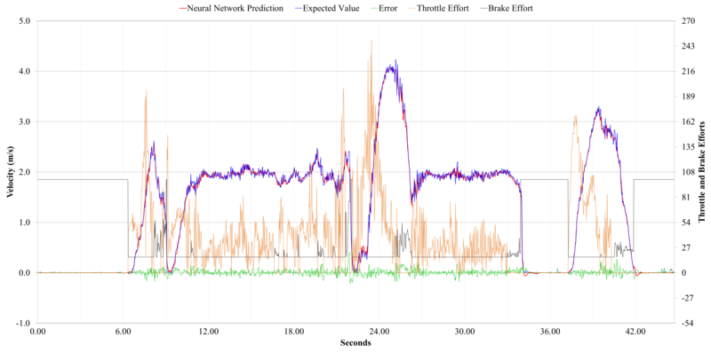
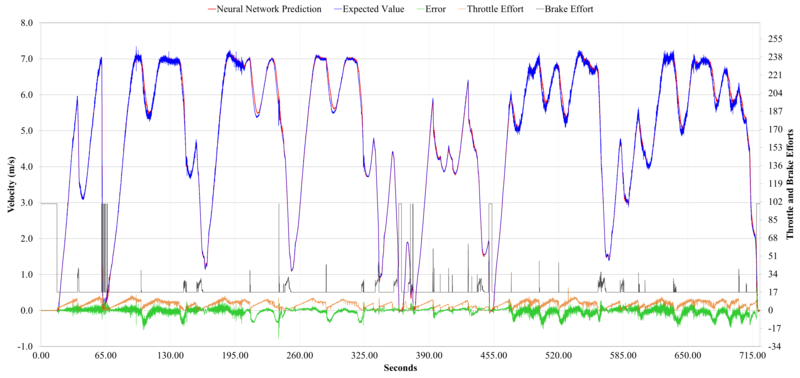

# dgfann_lcad

dgfann is a Distributed Genetic Algorithm framework for optimizing the configuration (number of layers, neuron types, number of neurons, etc.) of the neural networks (NN). dgfann finds  the best configurations of NNs and train them using fann (https://github.com/libfann/fann).

We present here dgfann_lcad installation and use for Ubuntu 12.04.

dgfann_lcad was used in the paper Alberto F. De Souza, Jacson Rodrigues Correia da Silva, Filipe Mutz, Claudine Badue, Thiago Oliveira-Santos, "Simulating Robotic Cars Using Multi-Layer Neural Networks", submitted to the 2016 International Joint Conference on Neural Networks - IJCNN'2016. You can find the datasets used in the paper as well as extra results below.


## Simulating Robotic Cars Using Multi-Layer Neural Networks

We proposed a simulator for robotic cars based on two multi-layer recurrent neural networks [1]. These networks are intended to simulate the mechanisms that govern how a set of effort commands changes the car’s velocity and the direction it is moving. The first neural network receives as input a temporal sequence of current and previous throttle and brake efforts, along with a temporal sequence of the previous car’s velocities (estimated by the network), and outputs the velocity that the real car would achieve in the next time interval given these inputs. The second neural network estimates the arctangent of curvature (a variable related to the steering wheel angle [1]) that a real car would reach in the next time interval given a temporal sequence of current and previous steering efforts and previous arctangents of curvatures of the car. 
We have built and used a genetic algorithm framework for optimizing the configuration (number of layers, neuron types, number of neurons, etc.) of the neural networks that comprise the simulator.
We evaluated the performance of our simulator using real-world datasets acquired using an autonomous robotic car (Fig. 1). Experimental results showed that our simulator was able to simulate in real time how a set of efforts influences the car’s velocity and arctangent of curvature. While navigating in a map of a real-world environment, our car simulator was able to emulate the velocity and arctangent of curvature of the real car with mean squared error of 2.2x10<sup>-3</sup> (m/s)<sup>2</sup> and 4.0x10<sup>-5</sup> rad<sup>2</sup>, respectively [1].

||
:--------------:
|**Fig. 1.	Intelligent and Autonomous Robotic Automobile (IARA), the robotic car platform simulated in this work (see it operating autonomously at https://youtu.be/LBM--2dAvyI).**|

## Installing dgfann

To install our genetic algorithm framework (dgfann) in Ubuntu:

* Install fann (http://leenissen.dk  We are using our own fann version due to pull request #64 - https://github.com/libfann/fann/pull/64)
  * git clone https://github.com/LCAD-UFES/fann.git
  * cd fann
  * make .
  * sudo make install
  * sudo apt-get install swig
  * sudo apt-get install python-dev
  * sudo pip install fann2
* Install dgfann
  * sudo pip install jsonrpclib
  * sudo apt-get install python-pyfann
  * sudo apt-get install gnuplot-x11
  * git clone https://github.com/LCAD-UFES/dgfann_lcad.git

Note: An initial version of dgfann can be found at https://github.com/jeiks/gdfann

## Data sets employed in [1]

In [1], we have used IARA (Fig. 1, above) to collect samples for building a training and a test datasets, T<sub>v</sub> and T<sub>c</sub> (see sections III.B and III.C of [1]). For that, we have set IARA to run autonomously in typical operating situations and logged data according with T<sub>v</sub> and T<sub>c</sub> descriptions, with k = 120 for T<sub>v</sub> and k = 40 for T<sub>c</sub>. The number of input-output pairs, n, collected for T<sub>v</sub> was equal to 5,366, and for T<sub>c</sub> was equal to 7,683. After data collection, each dataset was shuffled and split into two parts, (a) and (b), where (a) received 1/3 of the samples and (b) 2/3 of the samples. Part (a) was used as the test sets, T<sub>v</sub><sup>te</sup> and T<sub>c</sub><sup>te</sup>, while part (b) was divided into the training (2/3 of (b)), T<sub>v</sub><sup>tr</sup> and T<sub>c</sub><sup>tr</sup>, and validation (1/3 of (b)), T<sub>v</sub><sup>va</sup> and T<sub>c</sub><sup>va</sup>, sets. 

These datasets are available in this repository and can be acessed in the following links:

- [T<sub>v</sub><sup>te</sup>](dgfann_velocity/entradas/testes.fann)  
- [T<sub>c</sub><sup>te</sup>](dgfann_aoc/entradas/testes.fann)
- [T<sub>v</sub><sup>tr</sup>](dgfann_velocity/entradas/treino.fann)
- [T<sub>c</sub><sup>tr</sup>](dgfann_aoc/entradas/treino.fann)
- [T<sub>v</sub><sup>va</sup>](dgfann_velocity/entradas/validacao.fann)
- [T<sub>c</sub><sup>va</sup>](dgfann_aoc/entradas/validacao.fann)

All T<sub>v</sub> and T<sub>c</sub> datasets follow the format:

```
# Header: a line with three values: number of samples, network-input size, and network-output size
<number of samples> <network-input size> <network-output size>

# Samples: <number of samples> lines with <network-input size> values followed by <network-output size> values
<input 1> <input 2> ... <input <network-input size>> <output 1> <output 2> ... <output <network-output size>>
...
```

Where all T<sub>v</sub> datasets have \<network-input size\> equal to 360 and \<network-output size\> equal 1, while all T<sub>c</sub> datasets have \<network-input size\> equal to 80 and \<network-output size\> equal 1.

The previous links for the datasets refer to the pre-processed data (after shuffling and duplicates removal) as used in [1] to train, validate, and test the neural networks. The full velocity and AOC datasets in its raw format, the same dataset after each step of preprocessing, and the subsets obtained after the division in training, validation, and test datasets can be accessed in:

Velocity Datasets | Content
:---------------: | :------------------------:
[Tv<sup>full</sup> Raw](datasets/velocity/Tv_full.fann) | The complete dataset in its raw format (without neither shuffle nor duplicates removal)
[Tv<sup>full</sup> without duplicates](datasets/velocity/Tv_full-no_duplicates.fann) | The complete dataset after duplicates removal
[Tv<sup>full</sup> Index](datasets/velocity/Tv_full-index.csv) | A CSV file with three fields, the first is the sample position in the dataset Tv<sup>full</sup> without duplicates, the second is the respective position of the sample in the shuffled dataset (used to create Tv<sup>tr</sup>,Tv<sup>va</sup>,Tv<sup>te</sup>), and the third is the respective position of the sample in the in the raw dataset Tv<sup>full</sup> Raw. 
[Tv<sup>full</sup> shuffled](datasets/velocity/Tv_full-shuffled.fann) | The complete dataset after shuffling
[Tv<sup>tr</sup> samples](datasets/velocity/train.fann) | The subset from the complete dataset used to train the neural network as used for the experiments in [1]
[Tv<sup>tr</sup> sorted](datasets/velocity/train-sorted.fann) | The training dataset in its original order
[Tv<sup>tr</sup> index](datasets/velocity/train-index.csv) | A CSV file with four fields: the first represents the sample number in the shuffled training set; the second is the respective position of the sample in the full dataset Tv<sup>full</sup> after duplicates removal and shuffle; the third is the respective position of the sample in the full dataset Tv<sup>full</sup> after duplicates removal; and the fourth is the sample position in the full dataset Tv<sup>full</sup> before duplicates removal (Raw). 
[Tv<sup>va</sup> samples](datasets/velocity/validation.fann) | The subset from the complete dataset used to validate the neural network as used for the experiments in [1]
[Tv<sup>va</sup> sorted](datasets/velocity/validation-sorted.fann) | The validation dataset in its original order
[Tv<sup>va</sup> index](datasets/velocity/validation-index.csv) | A CSV file with four fields: the first represents the sample number in the shuffled validation set; the second is the respective position of the sample in the full dataset Tv<sup>full</sup> after duplicates removal and shuffle; the third is the respective position of the sample in the full dataset Tv<sup>full</sup> after duplicates removal; and the fourth is the sample position in the full dataset Tv<sup>full</sup> before duplicates removal (Raw).
[Tv<sup>te</sup> samples](datasets/velocity/tests.fann) | The subset from the complete dataset used to test the neural network as used for the experiments in [1]
[Tv<sup>te</sup> sorted](datasets/velocity/tests-sorted.fann) | The test dataset in its original order
[Tv<sup>te</sup> index](datasets/velocity/tests-index.csv) | A CSV file with four fields: the first represents the sample number in the shuffled test set; the second is the respective position of the sample in the full dataset Tv<sup>full</sup> after duplicates removal and shuffle; the third is the respective position of the sample in the full dataset Tv<sup>full</sup> after duplicates removal; and the fourth is the sample position in the full dataset Tv<sup>full</sup> before duplicates removal (Raw).


AOC Datasets | Content
:-------: | :-------:
[Tc<sup>full</sup> Raw](datasets/aoc/Tc_full.fann) | The complete dataset in its raw format (without neither shuffle nor duplicates removal)
[Tc<sup>full</sup> without duplicates](datasets/aoc/Tc_full-no_duplicates.fann) | The complete dataset after duplicates removal
[Tc<sup>full</sup> shuffled Index](datasets/aoc/Tc_full-index.csv) | A CSV file with three fields, the first is the sample position in the dataset Tc<sup>full</sup> without duplicates, the second is the respective position of the sample in the shuffled dataset (used to create Tc<sup>tr</sup>,Tc<sup>va</sup>,Tc<sup>te</sup>), and the third is the respective position of the sample in the in the raw dataset Tc<sup>full</sup> Raw. 
[Tc<sup>full</sup> shuffled](datasets/aoc/Tc_full-shuffled.fann) | The complete dataset after shuffling
[Tc<sup>tr</sup> samples](datasets/aoc/train.fann) | The subset from the complete dataset used to train the neural network as used for the experiments in [1]
[Tc<sup>tr</sup> sorted](datasets/aoc/train-sorted.fann) | The training dataset in its original order
[Tc<sup>tr</sup> index](datasets/aoc/train-index.csv) | A CSV file with four fields: the first represents the sample number in the shuffled training set; the second is the respective position of the sample in the full dataset Tc<sup>full</sup> after duplicates removal and shuffle; the third is the respective position of the sample in the full dataset Tc<sup>full</sup> after duplicates removal; and the fourth is the sample position in the full dataset Tc<sup>full</sup> before duplicates removal (Raw).
[Tc<sup>va</sup> samples](datasets/aoc/validation.fann) | The subset from the complete dataset used to validate the neural network as used for the experiments in [1]
[Tc<sup>va</sup> sorted](datasets/aoc/validation-sorted.fann) | The validation dataset in its original order
[Tc<sup>va</sup> index](datasets/aoc/validation-index.csv) | A CSV file with four fields: the first represents the sample number in the shuffled validation set; the second is the respective position of the sample in the full dataset Tc<sup>full</sup> after duplicates removal and shuffle; the third is the respective position of the sample in the full dataset Tc<sup>full</sup> after duplicates removal; and the fourth is the sample position in the full dataset Tc<sup>full</sup> before duplicates removal (Raw).
[Tc<sup>te</sup> samples](datasets/aoc/tests.fann) | The subset from the complete dataset used to test the neural network as used for the experiments in [1]
[Tc<sup>te</sup> sorted](datasets/aoc/tests-sorted.fann) | The test dataset in its original order
[Tc<sup>te</sup> index](datasets/aoc/tests-index.csv) | A CSV file with four fields: the first represents the sample number in the shuffled test set; the second is the respective position of the sample in the full dataset Tc<sup>full</sup> after duplicates removal and shuffle; the third is the respective position of the sample in the full dataset Tc<sup>full</sup> after duplicates removal; and the fourth is the sample position in the full dataset Tc<sup>full</sup> before duplicates removal (Raw).

## How to use the dgfann to find configurations of neural networks (NN) and train these NNs

To use the dgfann to find configurations of neural networks (NN) and train these NNs follow the steps below. 

For running the genetic algorithm in a single machine to configure and train the Velocity neural network [1]:

* Go to the directory of the Velocity neural network:
```sh
  cd dgfann_lcad/dgfann_velocity
```
* Set the parameters of this network in the file config.py (already set according to [1])
* Compile the Genetic Code (GC) C code:
```sh
  make
```
* In RNAGenetico.py, make shure you have 'distribuido=False' in the line:
```py
AG = AlgGenetico(tipoGenes, populacaoInicial, avaliacaoRNA, criterioSatisfacao,
                 considMaiorAvaliacao=False, maxGeracoes=maximoGeracoes, verboso=True, distribuido=False)
```
* Run GA with the command:
```sh
  ./RNAGenetico.py
```
* Copy the trained NNs of the last GA population (all, if the desired fitness was not achieved, or only those that achieved the desired fitness) to ../RNAs. The file names tell the configuration of each NN:
```
  ./utils/01-copiar_redes.sh
```
* The file names tell the configuration of each NN:
```
Ex.: 001-2_10_0_50_0_0.1_0.8_0.4_300.net means:
001: rank of the individual
  2: number of hidden layers
 10: hidden layer(s) activation function
  0: output layer activation function
 50: number of neurons in the hidden layer
  0: learning algorithm
0.1: learning rate
0.8: momentum
0.4: learning rate decay
300: maximum epochs to train
```

For running the genetic algorithm in a cluster [1]:

* In the master node, go to the directory of the Velocity neural network:
```sh
  cd dgfann_lcad/dgfann_velocity
```
* Set the parameters of this network in the file config.py (already set according to [1])
* Add the list of nodes at the end of the file config.py (or update this value if already exists):
```py
nodes = ['192.168.36.78', '192.168.36.79', ...]
```
* Compile the Genetic Code (GC) C code:
```sh
  make
```
* In RNAGenetico.py, make shure you have 'distribuido=True' in the line:
```py
AG = AlgGenetico(tipoGenes, populacaoInicial, avaliacaoRNA, criterioSatisfacao,
                 considMaiorAvaliacao=False, maxGeracoes=maximoGeracoes, verboso=True, distribuido=True)
```
* Repeat the installation process for all other nodes.
* In each node, except the master node, run:
```
cd dgfann_lcad/dgfann_velocity
make
./dgfann_node.py
```
* In the master node, run GA with the command:
```sh
  ./RNAGenetico.py
```
* When the program running in the master node ends, stop all nodes processes and copy the folder 'Redes_Geradas' to master. Put all these folders in dgfann parent folder.
```
 Ex.: parent_folder/
         01-dgfann/Redes_Geradas
         02-dgfann/Redes_Geradas
         ...
         nn-dgfann/Redes_Geradas
```
* In the master node, copy the trained NNs of the last GA population (all, if the desired fitness was not achieved, or only those that achieved the desired fitness) to ../RNAs.
```
  ./utils/01-copiar_redes.sh
```
* The file names tell the configuration of each NN:
```
Ex.: 001-2_10_0_50_0_0.1_0.8_0.4_300.net means:
001: rank of the individual
  2: number of hidden layers
 10: hidden layer(s) activation function
  0: output layer activation function
 50: number of neurons in the hidden layer
  0: learning algorithm
0.1: learning rate
0.8: momentum
0.4: learning rate decay
300: maximum epochs to train
```

**To run the GA to find configurations of the AOC neural network and train the AOC neural network, repeat the same process using the 'dgfann_aoc' directory instead of the 'dgfann_velocity' directory.**

## How to run your NNs and see the results
* In the master node, run the Velocity neural networks with the test set (it is defined in the file 'config.py', variable 'nomeArqTeste'):
```
cd dgfann_lcad/dgfann_velocity
./utils/02-gen_plots.sh
# the plots will be placed in 'results_plots'
# the neural outputs will be placed in 'results_ann'
```
* To AOC neural network, run the same command, but in directory 'dfgann_aoc' instead of 'dgfann_velocity'.

## Additional data and experiments

The datasets used in [1] were collected at 2014/03/20 (velocity data) and 2014/03/24 (AOC data). Both, the velocity and AOC datasets, were shuffled, and split in training, validation, and test sets. Fig. 2, Fig. 3, and Fig. 4 show the training, validation, and test datasets for the velocity network, and Fig. 5, Fig. 6, and Fig. 8 show the training, validation, and test datasets for the AOC data. Although the datasets look quite similar, they represent independent samples extracted from the same datasets. The equality in the distribution of data over all datasets is explained by the fact that the data were first shuffled, and only then split. 

|[](datasets/plots/Velocity_train.png)|
:-------------:
|**Fig. 2. Training dataset for the velocity network, captured in 2014/03/20**|

|[](datasets/plots/Velocity_validation.png)|
:-------------:
|**Fig. 3. Validation dataset for the velocity network, captured in 2014/03/20**|

|[](datasets/plots/Velocity_test.png)|
:-------------:
|**Fig. 4. Test dataset for the velocity network, captured in 2014/03/20**|

|[](datasets/plots/AOC_train.png)|
:-------------:
|**Fig. 5. Training dataset for the AOC network, captured in 2014/03/24**|

|[](datasets/plots/AOC_validation.png)|
:-------------:
|**Fig. 6. Validation dataset for the AOC network, captured in 2014/03/24**|

|[](datasets/plots/AOC_test.png)|
:-------------:
|**Fig. 8. Test dataset for the AOC network, captured in 2014/03/24**|

Two additional datasets were collected for both, velocity and AOC, to evaluate the generalization level of the neural networks, and to analyze their behavior in new challenging scenarios. These new datasets were not presented to any neural network during the execution of the genetic algorithm nor during the training phase of the neural networks. They were used to evaluate the performance and the behavior of the neural network in response to previously unseen stimuli. 
The first dataset ([dataset1: steering](datasets/new_datasets/steering-20140509.tar.bz2), [dataset1: velocity](datasets/new_datasets/velocity-20140509.tar.bz2)) was captured in the same parking lot used in the experiments presented in [1], while the second dataset ([dataset2: steering](datasets/new_datasets/steering-20140802.tar.bz2), [dataset2: velocity](datasets/new_datasets/velocity-20140802.tar.bz2)) was captured in the beltway of the *Universidade Federal do Espírito Santo* (UFES). They were collected, respectively, at 2014/05/09 and 2014/08/02. The parking lot dataset size is similar to the datasets used in [1], with more smooth movements and less variability however. In the beltway dataset, the robotic car performed significantly different maneuvers in comparison with the parking lot datasets. These new maneuvers represent a constant challenge to the neural net estimation process, and in certain points took to the limit the network's extrapolation capacity. The beltway dataset is algo challeging due to its significantly higher size in relation to the training and validation datasets.

Fig. 9 (another view in Fig. 10) and Fig. 11 (another view in Fig. 12) show the velocity and AOC data, respectively, for the parking lot dataset along with the estimations made by the best neural network found in [1].
Fig. 13 (another view in Fig. 14) and Fig. 15 (another view in Fig. 16) show the same data for the beltway dataset.
In the parking lot dataset, the neural net was able to successfully estimate the car’s velocity and AOC in the whole trajectory of the experiment. In the beltway dataset, on the other hand, the network produced satisfactory results for velocities as high as twice the ones seen in the training phase, but was unable to estimate values higher than that. Although the results demonstrated that the neural network was able to successfully generalize its knowledge to challenging unseen scenarios, the upper bound in the velocity estimations indicates that the neural net achieved its maximum extrapolation level. A neural network trained with additional high velocity data can attenuate the difference between the neural net predictions and the values measured by the car’s sensors. A new experiment with dgfann and a new train dataset is showed in next session.

|[](datasets/new_datasets/plots/Velocity_20140509-1.png)|
:-------------:
|**Fig. 9. Velocity for 2014/05/09 plotted as [1]**|

|[](datasets/new_datasets/plots/Velocity_20140509-2.png)|
:-------------:
|**Fig. 10. Velocity for 2014/05/09 (alternative visualization)**|

Fig. 9 and Fig.10 shows the neural network capacity to generalize the new dataset. With Mean Squared Error (MSE) of 4.1x10<sup>-3</sup>, this network has satisfactory results over the new parking lot dataset. Note that this dataset velocity is less than 3.5 m/s and the dataset used for [1] had values up to 4.5 m/s.

|[](datasets/new_datasets/plots/Steering_20140509-1.png)|
:-------------:
|**Fig. 11. AOC for 2014/05/09 plotted as [1]**|

|[](datasets/new_datasets/plots/Steering_20140509-2.png)|
:-------------:
|**Fig. 12. AOC for 2014/05/09 (alternative visualization)**|

|[](datasets/new_datasets/plots/Velocity_20140802-1.png)|
:-------------:
|**Fig. 13. Velocity for 2014/08/02 plotted as [1]**|

|[](datasets/new_datasets/plots/Velocity_20140802-2.png)|
:-------------:
|**Fig. 14. Velocity for 2014/08/02 (alternative visualization)**|

|[](datasets/new_datasets/plots/Steering_20140802-1.png)|
:-------------:
|**Fig. 15. AOC for 2014/08/02 plotted as [1]**|

|[](datasets/new_datasets/plots/Steering_20140802-2.png)|
:-------------:
|**Fig. 16. AOC for 2014/08/02 (alternative visualization)**|


The results of the new experiments can be accessed in the following links:

* [Steering 2014/05/09](datasets/new_datasets/plots/Steering_20140509.txt)
* [Velocity 2014/05/09](datasets/new_datasets/plots/Velocity_20140509.txt)
* [Steering 2014/08/02](datasets/new_datasets/plots/Steering_20140802.txt)
* [Velocity 2014/08/02](datasets/new_datasets/plots/Velocity_20140802.txt)

## New experiment for Velocity

In the previous section, two new datasets have been presented to the neural network. But in beltway dataset, the neural network was unable to estimate the higher values (Fig. 13 and Fig. 14) without bias. Based on that, it was made an additional experiment to attenuate the difference between the neural net predictions and the values measured by the car's velocity sensors. In this experiment, the 2510 first samples from 2014/08/02 (they can be seen at Fig. 14) were concatenated in training dataset used in [1] \(original dataset at Fig. 2 and this new dataset at Fig. 17\) and the dgfann was executed again to find the neural network configuration.

|[](datasets/new_datasets/plots/new_exp/Velocity_train_paper_dataset.png)|
:-------------:
|**Fig. 17. Train dataset for new experiment**|

The [neural network](datasets/new_datasets/new-exp-network.tar.bz2) found at this time showed almost the same configuration as the [neural network](dgfann_velocity/00-LAST_RAN_DATA/Best_Neural_Networks_found/2_10_0_50_0_0.1_0.8_0.4_300.net) that was found at [1], the difference was the number of hidden neurons:
- First hidden layer: from 50 to 300;
- Second hidden layer: from 25 to 150;

As we have seen, the first neural network could not generalize the values because it didn't have the sufficient number of hidden neurons. This experiment also showed that the new training dataset (composed with the higher values) was sufficient to the dgfann finds the best neural network configuration. 

This new neural network was able to successfully estimate the car velocity to all tests dataset, including the beltway dataset, resolving the problem mentioned in previous section. The results with the test datasets applied to this new neural network are:
- The Fig. 18 (another view in Fig. 19) shows the test dataset used in [1]. These results can be compared with Fig. 4 and Fig. 5.
- The Fig. 20 (another view in Fig. 21) shows the test for the second parking lot dataset (2014/05/09). These results can be compared with Fig. 9 and Fig. 10.
- And the Fig. 22 (another view in Fig. 23) shows the test for the **beltway** dataset (2014/08/02). These results can be compared with Fig. 13 and Fig. 14.

|[](datasets/new_datasets/plots/new_exp/Velocity_tests_paper_dataset-1.png)|
:-------------:
|**Fig. 18. Paper's test dataset for new experiment**|

|[](datasets/new_datasets/plots/new_exp/Velocity_tests_paper_dataset-2.png)|
:-------------:
|**Fig. 19. Paper's test dataset for new experiment (alternative visualization)**|

|[](datasets/new_datasets/plots/new_exp/Velocity_tests_20140509-1.png)|
:-------------:
|**Fig. 20. Second Parking lot dataset (2014/05/09) for new experiment**|

|[](datasets/new_datasets/plots/new_exp/Velocity_tests_20140509-2.png)|
:-------------:
|**Fig. 21. Second Parking lot dataset (2014/05/09) for new experiment (alternative visualization)**|

|[](datasets/new_datasets/plots/new_exp/Velocity_tests_20140802-1.png)|
:-------------:
|**Fig. 22. Beltway dataset for new experiment**|

|[](datasets/new_datasets/plots/new_exp/Velocity_tests_20140802-2.png)|
:-------------:
|**Fig. 23. Beltway dataset for new experiment (alternative visualization)**|

## References

    [1] Alberto F. De Souza, Jacson Rodrigues Correia da Silva, Filipe Mutz, Claudine Badue, Thiago Oliveira-Santos, "Simulating Robotic Cars Using Multi-Layer Neural Networks", submitted to IJCNN'2016.
